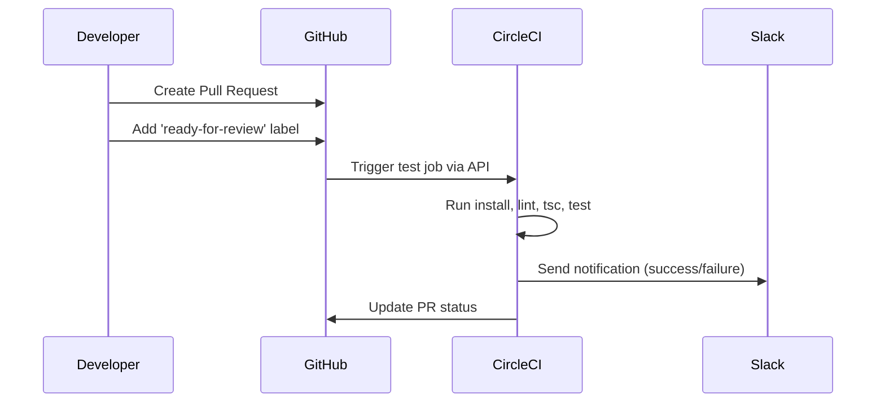
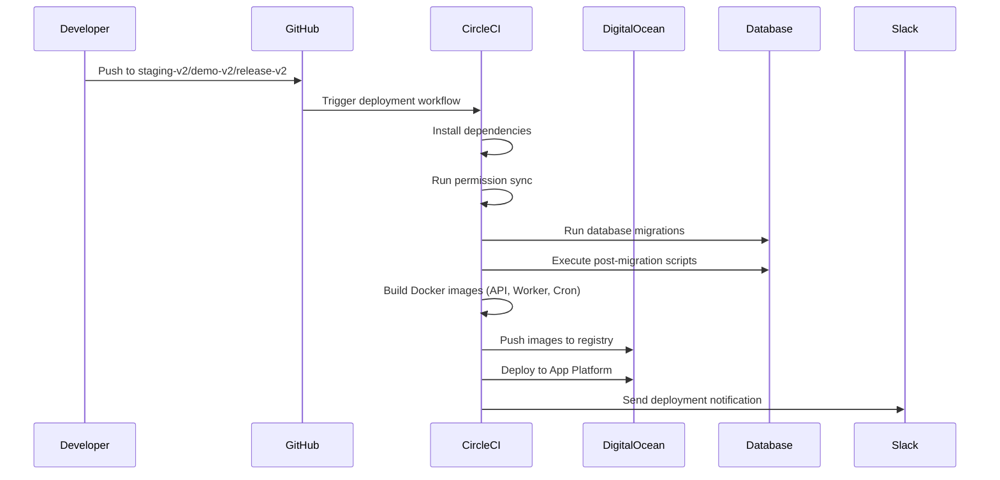
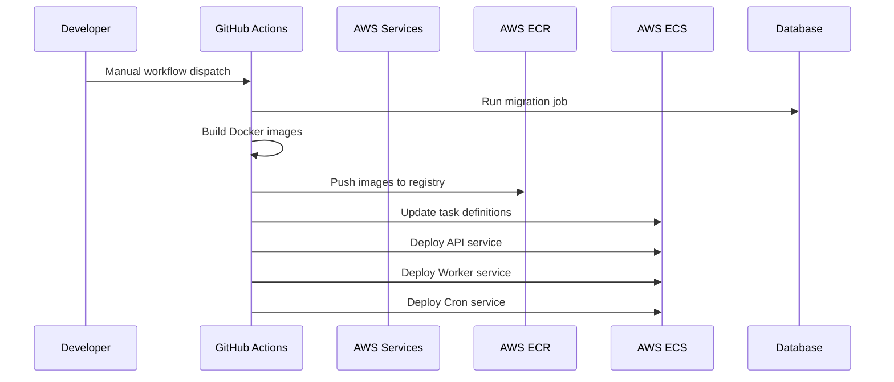
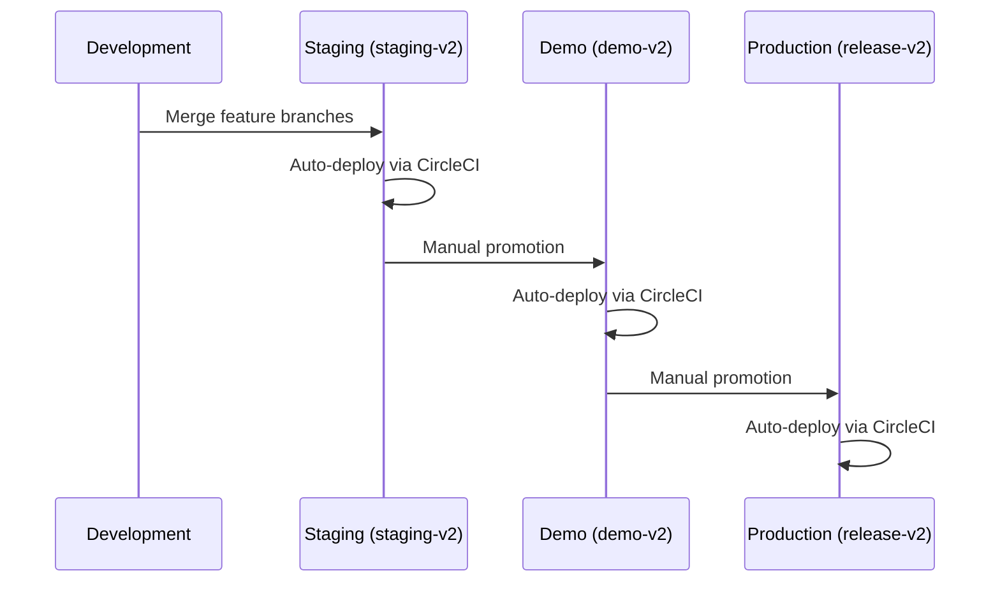
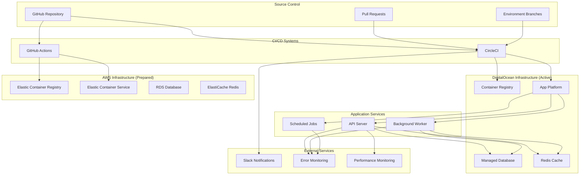
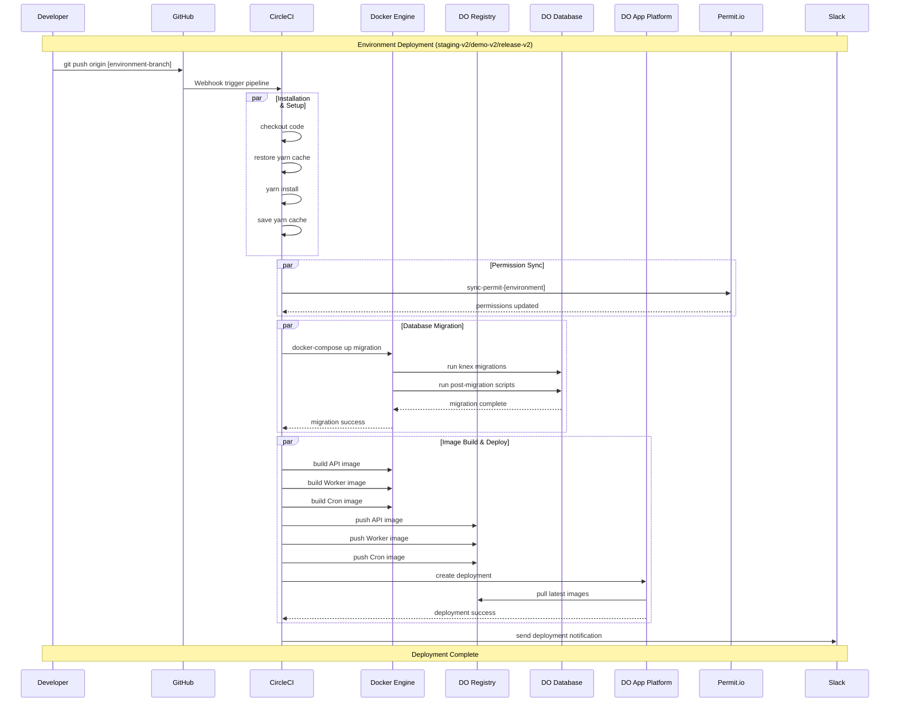

# CI/CD Documentation for Harold API

## Overview

Harold API uses a hybrid CI/CD approach with both **CircleCI** and **GitHub Actions** for different deployment strategies:
- **CircleCI**: Primary CI/CD pipeline for DigitalOcean deployments
- **GitHub Actions**: AWS deployments (currently disabled) and workflow management
- **Dual Infrastructure**: DigitalOcean (active) and AWS (prepared but disabled)

## CI/CD Flow Summary

### Pull Request Workflow



### DigitalOcean Deployment Flow (Active)



### AWS Deployment Flow (Disabled but Ready)



### Environment Promotion Flow



## Repository Structure

The repository contains multiple environments and deployment configurations:

### Environments
- **Development** (`dev`): Local development environment
- **Staging** (`staging-v2`): Staging environment for testing
- **Demo** (`demo-v2`): Demo environment for client demonstrations  
- **Production** (`release-v2`): Production environment

### Infrastructure Components
- **API**: Main GraphQL API server
- **Worker**: Background job processing
- **Cron**: Scheduled tasks and jobs
- **Database**: PostgreSQL with migrations
- **Redis**: Caching and session storage
- **RabbitMQ**: Message queuing

### Overall Architecture



## CircleCI Pipeline (.circleci/config.yml)

### Pipeline Structure

CircleCI handles the primary CI/CD workflow for DigitalOcean deployments.

#### Jobs Configuration

1. **Dependencies & Setup**
   - `install`: Install Node.js dependencies using Yarn
   - Caching strategy: `v6.0.11-yarn-lock-{{ checksum "yarn.lock" }}`

2. **Code Quality & Testing**
   - `tsc`: TypeScript compilation check
   - `lint`: ESLint with maximum 0 warnings
   - `lint-new-rules`: Lint only changed files with new rules
   - `lint-no-use-deprecated`: Check for deprecated API usage
   - `lint-goal`: Goal-based linting
   - `test`: Full test suite with PostgreSQL and Redis
   - `graphql-schema`: GraphQL schema validation

3. **Permission Synchronization**
   - `sync-permit-staging`: Sync permissions for staging
   - `sync-permit-demo`: Sync permissions for demo
   - `sync-permit-prod`: Sync permissions for production

#### Deployment Workflow

### Detailed CircleCI Deployment Sequence



#### Deployment Details

**DigitalOcean Deployment Process:**
1. **Database Migration**: Run Knex migrations and post-migration scripts
2. **Docker Build**: Build API, Worker, and Cron images
3. **Registry Push**: Push to DigitalOcean Container Registry
4. **Service Deployment**: Deploy using DigitalOcean App Platform

**Registry Structure:**
- `registry.digitalocean.com/harold-registry/staging:api`
- `registry.digitalocean.com/harold-registry/staging:worker`
- `registry.digitalocean.com/harold-registry/staging:cron`
- Similar for `demo` and `prod` environments

## GitHub Actions Workflows (.github/workflows/)

### Active Workflows

1. **PR Ready for Review** (`pr_ready.yml`)
   - **Trigger**: When PR is labeled with `ready-for-review`
   - **Action**: Triggers CircleCI test job via API
   - **Purpose**: Automated testing on PR readiness

2. **Slack Notifications** (`slack-notification.yml`)
   - **Purpose**: Send deployment notifications to Slack channels

3. **Container Tracking** (`node.js.yml`)
   - **Trigger**: Push to `container-tracking` branch
   - **Purpose**: Track container status and send Teams notifications

4. **Label Management** (`remove-pr-labels.yml`)
   - **Purpose**: Automated PR label management

### AWS Deployment Workflows (Currently Disabled)

The following workflows are prepared but disabled via `workflow_dispatch`:

1. **Staging AWS** (`staging-v2.yml`)
2. **Demo AWS** (`demo-v2.yml`)
3. **Production AWS** (`release-v2.yml`)

#### AWS Deployment Process (When Enabled)

**Infrastructure:**
- **ECR Repository**: `jules` in `eu-west-3`
- **ECS Cluster**: Environment-specific (e.g., `jules-staging`)
- **Services**: API, Worker, Cron deployed separately

**Workflow Steps:**
1. **Migration**: Database migration using Docker Compose
2. **Build & Push**: Build and push images to AWS ECR
3. **Deploy**: Deploy to ECS using task definitions from `.aws/` directory

## AWS Configuration (.aws/)

### Task Definitions

The `.aws/` directory contains ECS task definitions for each environment and service:

- `task-definition.staging.json` - Staging API
- `task-definition.staging.worker.json` - Staging Worker
- `task-definition.staging.cron.json` - Staging Cron
- `task-definition.prod.json` - Production API
- `task-definition.prod.worker.json` - Production Worker
- `task-definition.prod.cron.json` - Production Cron
- `task-definition.demo.json` - Demo API
- `task-definition.demo.worker.json` - Demo Worker
- `task-definition.demo.cron.json` - Demo Cron

### Resource Allocation

**Staging API Configuration:**
- **CPU**: 3686 units
- **Memory**: 7373 MB
- **Port**: 80
- **Command**: `["yarn", "start:api"]`

## Docker Configuration

### Multi-Stage Dockerfiles

1. **Dockerfile.api**: API server container
2. **Dockerfile.worker**: Background worker container
3. **Dockerfile.cron**: Cron job container
4. **Dockerfile**: Main multi-target dockerfile

### Docker Compose Files

Environment-specific compose files:
- `docker-compose.dev.yml`: Development
- `docker-compose.staging.yml`: Staging (DigitalOcean)
- `docker-compose.staging.aws.yml`: Staging (AWS)
- `docker-compose.demo.yml`: Demo (DigitalOcean)
- `docker-compose.demo.aws.yml`: Demo (AWS)
- `docker-compose.prod.yml`: Production (DigitalOcean)
- `docker-compose.prod.aws.yml`: Production (AWS)

## Environment Variables & Secrets

### CircleCI Secrets
- `DIGITAL_OCEAN_TOKEN`: DigitalOcean API token
- `PERMITIO_KEY_*`: Permission service keys per environment
- Slack webhook URLs for notifications

### GitHub Secrets (for AWS)
- `AWS_ACCESS_KEY_ID`: AWS access key
- `AWS_SECRET_ACCESS_KEY`: AWS secret key
- Database connection strings
- Service API keys (SendGrid, Carbone, etc.)

### Environment Files
- `env.dev.sh`: Development environment variables
- `env.staging.sh`: Staging environment variables
- `env.demo.sh`: Demo environment variables
- `env.demo.v2.sh`: Demo v2 environment variables
- `env.prod.sh`: Production environment variables

## Database Management

### Migration Strategy

**Migration Commands:**
- `yarn migrate:dev`: Development migrations
- `yarn migrate:staging`: Staging migrations
- `yarn migrate:demo`: Demo migrations
- `yarn migrate:prod`: Production migrations

**Post-Migration:**
- `yarn postMigration`: Run post-migration scripts
- Includes view recreation and data transformations

### Database Environments

**Development:**
- Local PostgreSQL instance
- Port: 5432
- Database: `haroldwaste`

**Staging:**
- DigitalOcean Managed Database
- Connection pooling enabled
- Schema: `geminirubber`

**Production:**
- DigitalOcean/AWS RDS instances
- High availability configuration
- Automated backups

## Monitoring & Notifications

### Slack Integration
- Deployment success/failure notifications
- Webhook-based notifications via `scripts/notifyWebhook.sh`
- Channel-specific notifications per environment

### Microsoft Teams
- Container tracking notifications
- Status updates for scheduled jobs

### Error Tracking
- Sentry integration for error monitoring
- Datadog APM for application performance

## Security & Compliance

### Secret Management
- Environment-specific secret injection
- Secure handling of API keys and tokens
- Database credential rotation support

### Code Quality
- ESLint with strict rules
- TypeScript strict mode
- Deprecation warnings treated as errors
- Pre-commit hooks (via CI)

## Deployment Branches & Strategy

### Branch Strategy

```
main (development)
├── staging-v2 (staging deployments)
├── demo-v2 (demo deployments)
├── release-v2 (production deployments)
```

### Deployment Flow

1. **Development**: Features developed on feature branches
2. **Staging**: Merge to `staging-v2` triggers staging deployment
3. **Demo**: Merge to `demo-v2` triggers demo deployment
4. **Production**: Merge to `release-v2` triggers production deployment

### Rollback Strategy

**CircleCI Rollback:**
- Manual intervention required
- Database rollback: `yarn rollback:dev/staging/prod`
- Container rollback: Redeploy previous image tags

**AWS Rollback (when enabled):**
- ECS service rollback via AWS Console
- Database migration rollback requires manual intervention

## Troubleshooting

### Common Issues

1. **Migration Failures**
   - Check database connectivity
   - Verify migration scripts
   - Review post-migration dependencies

2. **Docker Build Failures**
   - Check Dockerfile syntax
   - Verify base image availability
   - Review build context and .dockerignore

3. **Deployment Failures**
   - Verify environment variables
   - Check service health endpoints
   - Review resource allocation

### Debug Commands

```bash
# Local debugging
make ssh-api          # SSH into API container
make ssh-worker       # SSH into Worker container
make ssh-cron         # SSH into Cron container
make ssh-db           # SSH into Database container

# Log monitoring
make logs             # View API logs
docker logs harold_worker --tail 100 -f
docker logs harold_cron --tail 100 -f
```

### Health Checks

- **API Health**: `GET /health` endpoint
- **Database**: Connection pool monitoring
- **Redis**: Cache availability checks
- **RabbitMQ**: Queue depth monitoring

## Performance Optimization

### Resource Tuning

**Development:**
- Node.js: `--max_old_space_size=4096`
- Jest: `--maxWorkers=50%`

**Production:**
- ECS CPU/Memory optimization
- Connection pool tuning
- Redis cache strategies

### Caching Strategy

- **Redis**: Session and query caching
- **CDN**: Static asset delivery
- **Database**: Query result caching

---

*Last updated: August 2025*
*Repository: harold-waste/harold-api*
*Branch: add-third-party-deprecated*
