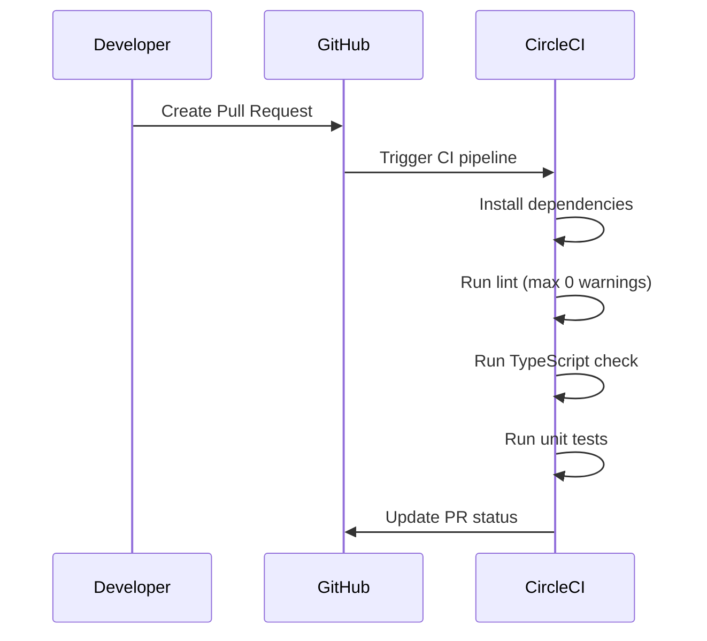
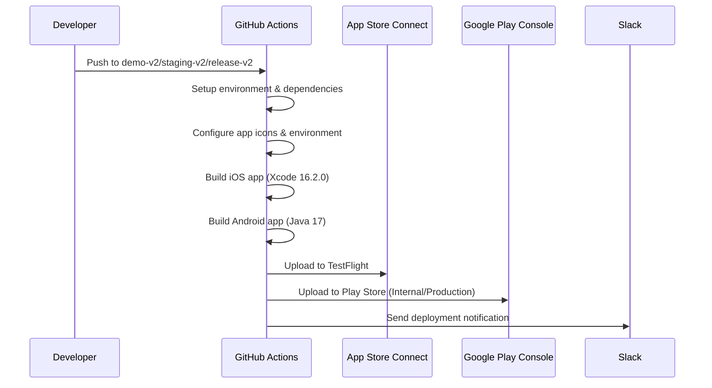
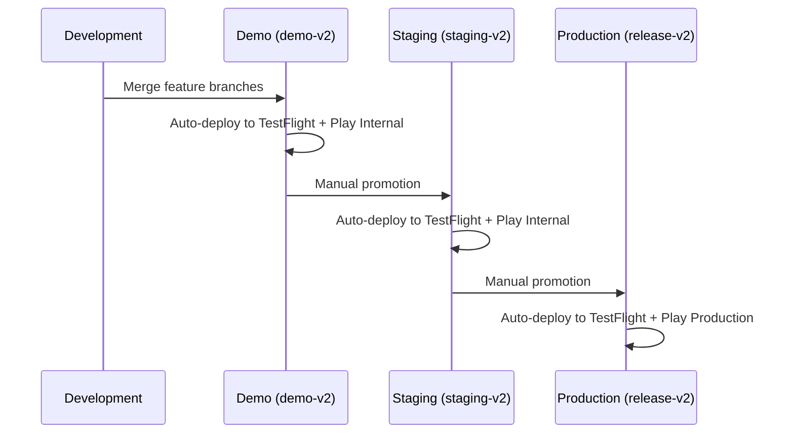
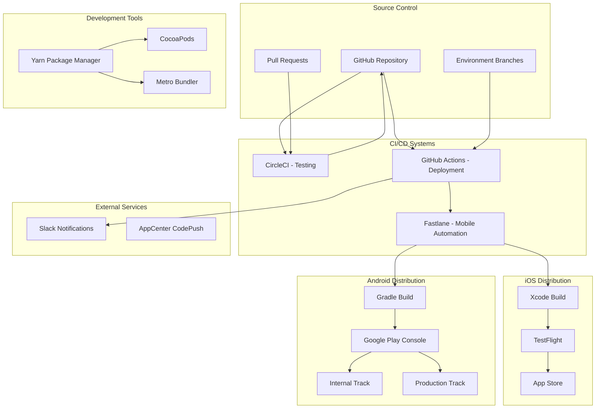
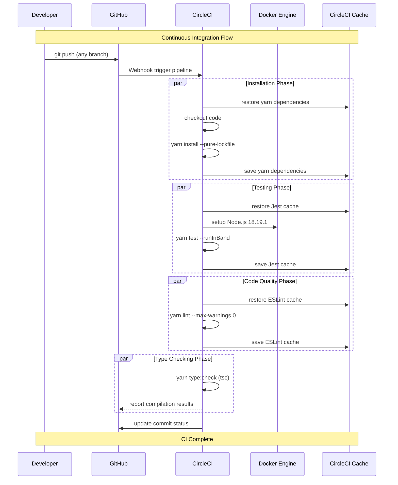
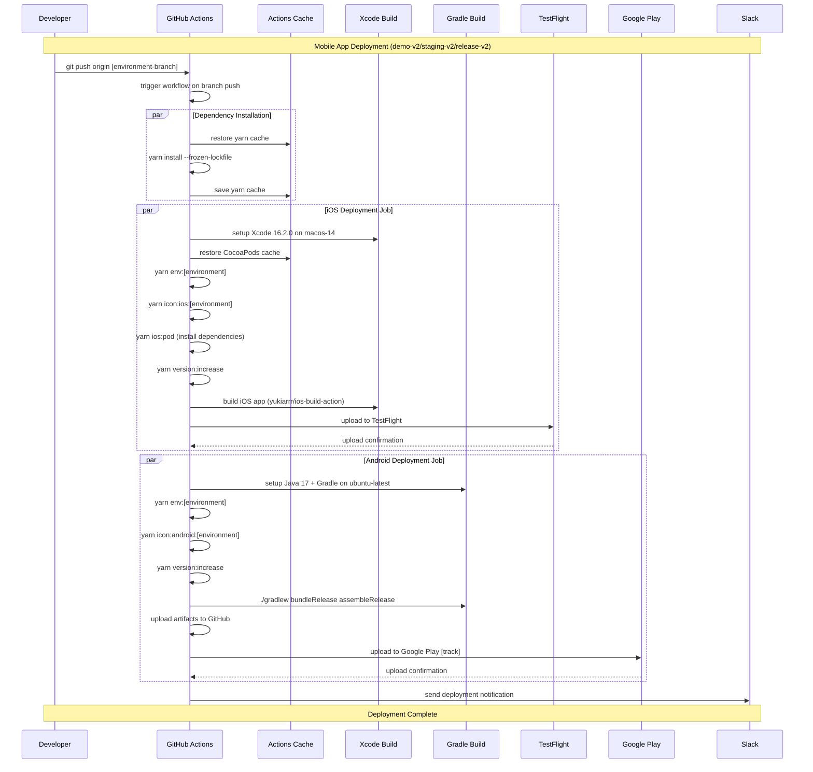
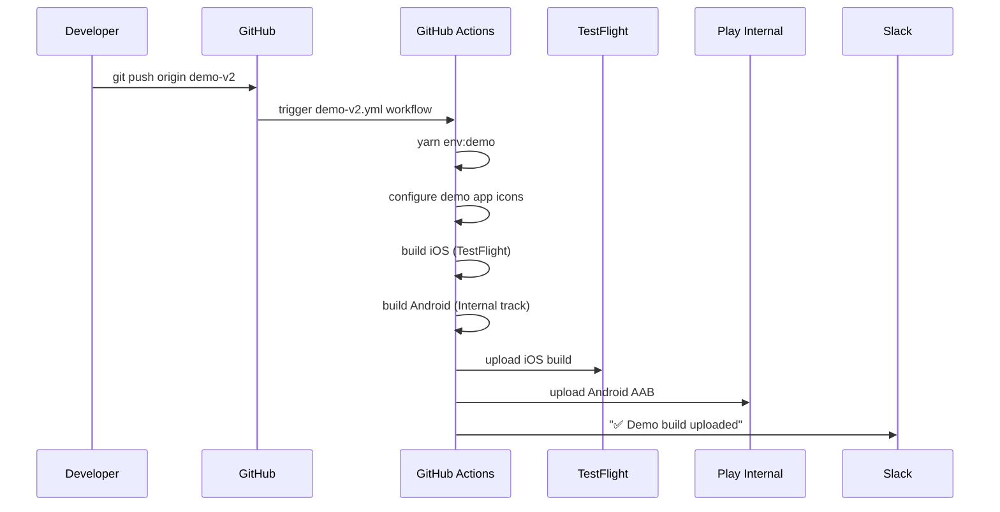
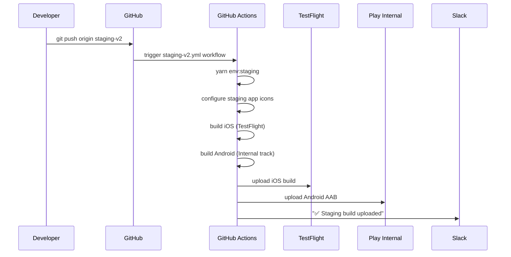
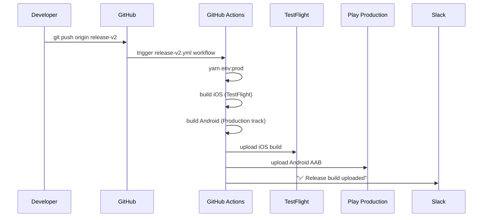

# CI/CD Documentation for Harold Mobile App

## Overview

Harold Mobile App uses a comprehensive CI/CD approach with multiple deployment platforms:
- **CircleCI**: Continuous integration for testing, linting, and type checking
- **GitHub Actions**: Automated mobile app deployment to app stores
- **Fastlane**: Mobile-specific build automation and store deployment
- **AppCenter**: CodePush for over-the-air updates (legacy integration)

## CI/CD Flow Summary

### Pull Request Workflow



### Mobile Deployment Flow



### Environment Promotion Flow



## Repository Structure

The repository contains a React Native mobile application with multi-platform deployment:

### Environments
- **Demo** (`demo-v2`): Demo environment for client demonstrations
- **Staging** (`staging-v2`): Staging environment for testing
- **Production** (`release-v2`): Production environment for app stores

### Platform Components
- **iOS**: React Native iOS app with CocoaPods dependencies
- **Android**: React Native Android app with Gradle build system
- **Shared**: React Native JavaScript/TypeScript codebase
- **Assets**: Environment-specific app icons and configurations

### Overall Architecture



## Table of Contents

1. [CircleCI Pipeline](#circleci-pipeline-circleciconfigyml)
2. [GitHub Actions Workflows](#github-actions-workflows-githubworkflows)
3. [Fastlane Configuration](#fastlane-configuration)
4. [Environment Management](#environment-management)
5. [Secrets and Configuration](#secrets-and-configuration)
6. [Deployment Workflows](#deployment-workflows)
7. [Manual Deployment Commands](#manual-deployment-commands)
8. [Troubleshooting](#troubleshooting)

## CircleCI Pipeline (.circleci/config.yml)

### Pipeline Structure

CircleCI handles continuous integration with comprehensive testing and quality checks.

#### Jobs Configuration

1. **Dependencies & Setup**
   - `install`: Install Node.js dependencies using Yarn
   - Caching strategy: `v5-yarn-lock-{{ checksum "yarn.lock" }}`

2. **Code Quality & Testing**
   - `test`: Jest unit tests with `--runInBand --ci --logHeapUsage`
   - `lint`: ESLint with maximum 0 warnings allowed
   - `tsc`: TypeScript compilation and type checking

### Detailed CircleCI Testing Sequence



#### CI Environment Configuration

**Docker Environment:**
- **Image**: `cimg/node:18.19.1`
- **Working Directory**: `~/harold-mobile`
- **Environment Variables**: `CI=true`, `TERM=xterm`

**Caching Strategy:**
- **Dependencies**: Based on `yarn.lock` checksum
- **ESLint**: Per-revision caching for incremental linting
- **Jest**: Per-revision caching for test performance

**Job Dependencies:**
```yaml
workflows:
  build_test:
    jobs:
      - install
      - test (requires: install)
      - lint (requires: install) 
      - tsc (requires: install)
```

## GitHub Actions Workflows (.github/workflows/)

### Active Deployment Workflows

The repository contains three main deployment workflows for different environments:

1. **Demo Deployment** (`demo-v2.yml`)
   - **Trigger**: Push to `demo-v2` or `add-github-action-deployment` branches
   - **Environment**: `demo`
   - **Target**: TestFlight + Google Play Internal Track

2. **Staging Deployment** (`staging-v2.yml`)
   - **Trigger**: Push to `staging-v2` or `add-github-action-deployment` branches  
   - **Environment**: `staging`
   - **Target**: TestFlight + Google Play Internal Track

3. **Release Deployment** (`release-v2.yml`)
   - **Trigger**: Push to `release-v2` or `add-github-action-deployment-release` branches
   - **Environment**: `release`
   - **Target**: TestFlight + Google Play Production Track

### Detailed GitHub Actions Deployment Sequence



### Platform-Specific Configuration

#### iOS Deployment Configuration
- **Runner**: `macos-14`
- **Xcode Version**: `16.2.0`
- **Working Directory**: `ios/`
- **Environment Variable**: `NO_FLIPPER=1`

**iOS Build Process:**
1. Setup Xcode environment
2. Checkout repository and restore caches
3. Install JavaScript dependencies
4. Configure environment-specific settings
5. Configure app icons for environment
6. Install CocoaPods dependencies
7. Increment version using timestamp
8. Build IPA using iOS Build Action
9. Upload to TestFlight using Apple Actions

#### Android Deployment Configuration  
- **Runner**: `ubuntu-latest`
- **Java Version**: 17 (Temurin distribution)
- **Working Directory**: `android/`

**Android Build Process:**
1. Setup Java and Gradle environment
2. Checkout repository and restore caches
3. Install JavaScript dependencies
4. Configure environment-specific settings
5. Configure app icons for environment
6. Increment version using timestamp
7. Build APK and AAB using Gradle
8. Upload artifacts to GitHub Actions
9. Upload to Google Play Console
10. Send Slack notification

### Conditional Deployment Logic

**Skip Conditions:**
- iOS deployment skips if commit message contains `-ios`
- Android deployment skips if commit message contains `-android`

**Environment Dependencies:**
```yaml
deploy-ios:
  needs: [yarn_install]
  environment: [demo|staging|release]
  
deploy-android:
  needs: [yarn_install] 
  environment: [demo|staging|release]
```

## Fastlane Configuration

### Mobile Deployment Automation

Fastlane provides platform-specific automation for building and deploying mobile applications.

#### Android Fastlane (`android/fastlane/Fastfile`)

**Available Lanes:**
- `test`: Execute Android Gradle tests
- `bump_version_code`: Update version code with current timestamp
- `build_app_with_gradle`: Clean and build release APK
- `staging`: Build and deploy to staging environment
- `demo`: Build and deploy to demo environment  
- `prod`: Build and deploy to production environment

**Version Management:**
```ruby
lane :bump_version_code do
  path = File.join(Dir.pwd, "..", "app/build.gradle")
  re = /versionCode\s+(\d+)/ 
  s = File.read(path)
  s[re, 1] = Time.new.to_i.to_s  # Use timestamp as version code
  f = File.new(path, 'w')
  f.write(s)
  f.close
end
```

#### iOS Fastlane (`ios/fastlane/Fastfile`)

**Available Lanes:**
- `prod`: Production deployment to TestFlight

**Production Deployment Flow:**
```ruby
lane :prod do
  ensure_git_status_clean                    # Verify clean git state
  build_number = Time.new.to_i               # Generate timestamp build number
  increment_build_number build_number: build_number
  
  get_certificates(output_path: "./builds")  # Download certificates
  get_provisioning_profile(                  # Download provisioning profile
    output_path: "./builds",
    filename: "provisioning.mobileprovision"
  )
  
  update_project_provisioning(               # Update Xcode project
    xcodeproj: "harold.xcodeproj",
    target_filter: "harold",
    profile: "./builds/provisioning.mobileprovision",
    build_configuration: "Release"
  )
  
  build_app(                                 # Build IPA
    workspace: "harold.xcworkspace",
    scheme: "harold",
    clean: true
  )
  
  upload_to_testflight                       # Upload to TestFlight
end
```

### Fastlane Integration with Package Scripts

The `package.json` includes Fastlane integration commands:

```json
{
  "scripts": {
    "fastlane:android:demo": "git pull && yarn setenv:demo && cd android && fastlane demo && yarn setenv:dev && cd ..",
    "fastlane:android:staging": "git pull && yarn setenv:staging && cd android && fastlane staging && yarn setenv:dev && cd ..",
    "fastlane:android:prod": "git pull && yarn setenv:prod && cd android && fastlane prod && yarn setenv:dev && cd ..",
    "fastlane:ios:prod": "git pull && yarn setenv:prod && cd ios && fastlane prod && cd .."
  }
}
```

## Environment Management

### Environment Configuration Strategy

The application uses environment-specific configuration files and build-time asset swapping.

#### Environment Files Structure
```
├── .env.dev          # Development environment
├── .env.demo         # Demo environment  
├── .env.staging      # Staging environment
├── .env.prod         # Production environment
└── .env              # Active environment (copied from above)
```

#### Environment Setup Scripts

**Pre-build Script** (`appcenter-pre-build.sh`):
```bash
#!/usr/bin/env bash
echo "Setting environment variables"
rm .env

if [ "$ENV" == "dev" ]; then
  echo "Configuring development environment"
  cp .env.dev .env
fi

if [ "$ENV" == "staging" ]; then
  echo "Configuring staging environment" 
  cp .env.staging .env
fi

if [ "$ENV" == "demo" ]; then
  echo "Configuring demo environment"
  cp .env.demo .env
fi

if [ "$ENV" == "prod" ]; then
  echo "Configuring production environment"
  cp .env.prod .env
fi
```

**Post-clone Script** (`appcenter-post-clone.sh`):
```bash
#!/usr/bin/env bash
CUR_COCOAPODS_VER=`sed -n -e 's/^COCOAPODS: \([0-9.]*\)/\1/p' ios/Podfile.lock`
ENV_COCOAPODS_VER=`pod --version`

# Ensure CocoaPods version matches project requirements
if [ $CUR_COCOAPODS_VER != $ENV_COCOAPODS_VER ]; then
    echo "Uninstalling all CocoaPods versions"
    sudo gem uninstall cocoapods --all --executables
    echo "Installing CocoaPods version $CUR_COCOAPODS_VER"
    sudo gem install cocoapods -v $CUR_COCOAPODS_VER
    pod --version
else 
    echo "CocoaPods version is suitable for the project"
fi
```

### App Icon Configuration

Environment-specific app icons are swapped during the build process:

#### iOS App Icons
```
assets/images/
├── AppIcon.appiconset.demo/     # Demo environment icons
├── AppIcon.appiconset.staging/  # Staging environment icons
└── AppIcon.appiconset/          # Default/production icons
```

**Icon Swap Commands:**
```bash
# Demo iOS icons
yarn icon:ios:demo
# Removes: ios/harold/Images.xcassets/AppIcon.appiconset
# Copies: assets/images/AppIcon.appiconset.demo

# Staging iOS icons  
yarn icon:ios:staging
# Removes: ios/harold/Images.xcassets/AppIcon.appiconset
# Copies: assets/images/AppIcon.appiconset.staging
```

#### Android App Icons
```
assets/images/
├── AndroidIcon.demo/     # Demo environment resources
├── AndroidIcon.staging/  # Staging environment resources
└── (default in android/app/src/main/res/)
```

**Icon Swap Commands:**
```bash
# Demo Android icons
yarn icon:android:demo
# Removes: android/app/src/main/res
# Copies: assets/images/AndroidIcon.demo

# Staging Android icons
yarn icon:android:staging  
# Removes: android/app/src/main/res
# Copies: assets/images/AndroidIcon.staging
```

### Package.json Environment Scripts

```json
{
  "scripts": {
    "env:staging": "rm .env && cp .env.staging .env",
    "env:demo": "rm .env && cp .env.demo .env", 
    "env:prod": "rm .env && cp .env.prod .env",
    
    "setenv:demo": "ENV=demo sh appcenter-pre-build.sh",
    "setenv:dev": "ENV=dev sh appcenter-pre-build.sh",
    "setenv:prod": "ENV=prod sh appcenter-pre-build.sh",
    "setenv:staging": "ENV=staging sh appcenter-pre-build.sh"
  }
}
```

## Secrets and Configuration

### Required GitHub Secrets

The GitHub Actions workflows require the following secrets to be configured in the repository settings:

#### iOS Deployment Secrets
- `IOS_P12_BASE64`: Base64 encoded iOS distribution certificate (.p12 file)
- `IOS_MOBILE_PROVISION_BASE64`: Base64 encoded iOS provisioning profile 
- `IOS_TEAM_ID`: Apple Developer Team ID (10-character string)
- `IOS_CERTIFICATE_PASSWORD`: Password for the iOS certificate
- `APPSTORE_ISSUER_ID`: App Store Connect API Issuer ID
- `APPSTORE_API_KEY_ID`: App Store Connect API Key ID  
- `APPSTORE_API_PRIVATE_KEY`: App Store Connect API Private Key (Base64 encoded)

#### Android Deployment Secrets
- `KEYSTORE_PASS`: Android release keystore password
- `SERVICE_ACCOUNT_JSON`: Google Play Console Service Account JSON (for upload API)

#### Notification Secrets
- `SLACK_WEBHOOK_URL`: Slack webhook URL for deployment notifications

### GitHub Environment Configuration

GitHub Environments provide deployment protection and approval workflows:

#### Environment Setup
- **demo**: Demo environment with optional approval requirements
- **staging**: Staging environment with optional approval requirements  
- **release**: Production environment with approval requirements and branch protection

#### Environment Variables per Environment
Each environment can have specific variables:
- API endpoints and backend URLs
- Feature flags and configuration toggles
- Analytics and monitoring service keys
- Push notification certificates

### Secret Management Best Practices

#### Certificate Management
```bash
# Converting iOS certificate to Base64
openssl base64 -in distribution_cert.p12 -out cert_base64.txt

# Converting provisioning profile to Base64  
base64 -i distribution_profile.mobileprovision -o profile_base64.txt
```

#### Service Account Setup (Android)
1. Create Service Account in Google Cloud Console
2. Grant "Service Account User" role
3. Download JSON key file
4. Base64 encode the JSON file for GitHub secret

#### Security Considerations
- Rotate certificates before expiration
- Use least-privilege access for service accounts
- Enable GitHub secret scanning
- Regularly audit secret access logs
- Use environment-specific secrets where possible

### Local Development Configuration

#### Environment File Templates
```bash
# .env.dev (Development)
API_URL=http://localhost:3000
DEBUG_MODE=true
ANALYTICS_ENABLED=false

# .env.staging (Staging)  
API_URL=https://staging-api.harold.com
DEBUG_MODE=true
ANALYTICS_ENABLED=true

# .env.prod (Production)
API_URL=https://api.harold.com  
DEBUG_MODE=false
ANALYTICS_ENABLED=true
```

#### React Native Config Integration
```typescript
// Using react-native-config
import Config from 'react-native-config';

const apiUrl = Config.API_URL;
const debugMode = Config.DEBUG_MODE === 'true';
```

## Deployment Workflows

### Environment-Specific Deployment Flows

#### Demo Environment Deployment



#### Staging Environment Deployment



#### Production Environment Deployment



### Build Configuration Matrix

| Environment | Branch | iOS Target | Android Target | App Icons | Environment Config |
|-------------|--------|------------|----------------|-----------|-------------------|
| Demo | `demo-v2` | TestFlight | Internal Track | Demo icons | `.env.demo` |
| Staging | `staging-v2` | TestFlight | Internal Track | Staging icons | `.env.staging` |
| Production | `release-v2` | TestFlight | Production Track | Default icons | `.env.prod` |

### Version Management Strategy

#### Automated Version Incrementing
```bash
# Version increment using timestamp
yarn version:increase
# Executes: react-native-version -A -s `date +%s`
# Updates both iOS and Android version codes

# Android version file update
yarn update:android:version  
# Extracts version from package.json to android/app/version.txt
```

#### Version Schema
- **iOS Build Number**: Unix timestamp (e.g., `1691500800`)
- **Android Version Code**: Unix timestamp (e.g., `1691500800`)
- **Marketing Version**: Semantic versioning from `package.json` (e.g., `2.14.26`)

### App Store Distribution Tracks

#### iOS TestFlight Distribution
- **Demo**: TestFlight internal testing
- **Staging**: TestFlight internal testing  
- **Production**: TestFlight → App Store production

#### Android Play Console Distribution
- **Demo**: Internal testing track (limited users)
- **Staging**: Internal testing track (limited users)
- **Production**: Production track (public release)

### Deployment Notifications

#### Slack Integration
Each successful deployment sends environment-specific notifications:

```bash
# Demo notification
"✅ Android Demo build uploaded: <artifact_url>"

# Staging notification  
"✅ Android Staging build uploaded: <artifact_url>"

# Production notification
"✅ Android Release build uploaded: <artifact_url>"
```

### Rollback Procedures

#### iOS Rollback
1. **TestFlight**: Disable current build, promote previous build
2. **App Store**: Submit previous version for review
3. **Emergency**: Use CodePush for critical fixes

#### Android Rollback  
1. **Internal Track**: Promote previous AAB version
2. **Production**: Use Play Console staged rollout controls
3. **Emergency**: Halt rollout and promote previous version

#### CodePush Rollback (Legacy)
```bash
# iOS CodePush rollback
appcenter codepush rollback -a reda.boumahdi/Harold-ios -d Production

# Android CodePush rollback  
appcenter codepush rollback -a reda.boumahdi/Harold -d Production
```

## Manual Deployment Commands

### Local Development Commands

#### Environment Configuration
```bash
# Environment switching
yarn env:demo      # Switch to demo environment (.env.demo → .env)
yarn env:staging   # Switch to staging environment (.env.staging → .env)  
yarn env:prod      # Switch to production environment (.env.prod → .env)

# Environment setup with AppCenter integration
yarn setenv:demo     # ENV=demo sh appcenter-pre-build.sh
yarn setenv:staging  # ENV=staging sh appcenter-pre-build.sh
yarn setenv:prod     # ENV=prod sh appcenter-pre-build.sh
yarn setenv:dev      # ENV=dev sh appcenter-pre-build.sh
```

#### iOS Development Commands
```bash
# Dependency management
yarn ios:pod         # cd ios && pod install && cd ..
yarn ios:pod:update  # Update CocoaPods dependencies

# Build and run
yarn ios             # Run on iOS simulator (iPhone 16 Pro Max)
yarn ios:simulator   # Run on iOS simulator
yarn ios:device      # Run on connected iOS device
yarn ios:release     # Run release build on simulator

# Environment-specific runs
yarn ios:dev         # Run with development config
yarn ios:demo        # Run with demo config + demo icons
yarn ios:staging     # Run with staging config  
yarn ios:prod        # Run with production config

# Maintenance
yarn ios:clean       # Clean iOS build artifacts
yarn ios:reset       # Clean and reinstall dependencies
yarn ios:troubleshoot # Run diagnostics and reset
```

#### Android Development Commands
```bash
# Build and run
yarn android           # Run on Android emulator
yarn android:emulator  # Run on Android emulator  
yarn android:device    # Run on connected Android device
yarn android:release   # Run release build

# Environment-specific runs
yarn android:dev       # Run with development config
yarn android:demo      # Run with demo config + demo icons
yarn android:staging   # Run with staging config
yarn android:prod      # Run with production config

# Build artifacts
yarn android:apk       # Build release APK
yarn android:bundle    # Build release AAB
yarn android:gradle    # Install debug build via Gradle

# Maintenance  
yarn android:clean     # Clean Android build artifacts
yarn android:reset     # Clean and rebuild
yarn android:troubleshoot # Run diagnostics and reset
```

### Production Deployment Commands

#### Fastlane Deployment
```bash
# Android deployments
yarn fastlane:android:demo     # Deploy to demo environment
yarn fastlane:android:staging  # Deploy to staging environment  
yarn fastlane:android:prod     # Deploy to production environment

# iOS deployments
yarn fastlane:ios:prod         # Deploy to production (TestFlight)
```

**Fastlane Command Breakdown:**
```bash
# Example: yarn fastlane:android:staging
git pull                        # Ensure latest code
yarn setenv:staging            # Configure staging environment
cd android && fastlane staging # Run Fastlane staging lane
yarn setenv:dev                # Reset to development environment
cd ..                          # Return to root directory
```

### Version Management Commands

#### Version Control
```bash
# Automatic version incrementing
yarn version:increase          # Increment build number with timestamp
yarn update:android:version    # Update Android version file

# Manual version management
npm version patch              # Increment patch version (e.g., 2.14.26 → 2.14.27)
npm version minor              # Increment minor version (e.g., 2.14.26 → 2.15.0)
npm version major              # Increment major version (e.g., 2.14.26 → 3.0.0)
```

### App Icon Management Commands

#### iOS App Icons
```bash
yarn icon:ios:demo             # Apply demo app icons to iOS
yarn icon:ios:staging          # Apply staging app icons to iOS
# Production uses default icons (no command needed)
```

#### Android App Icons  
```bash
yarn icon:android:demo         # Apply demo app icons to Android
yarn icon:android:staging      # Apply staging app icons to Android
# Production uses default icons (no command needed)
```

### Testing and Quality Assurance Commands

#### Continuous Integration Tests
```bash
# Run all tests (excluding integration tests)
yarn test                      # Jest with --runInBand --testPathIgnorePatterns

# Run integration tests only
yarn test:integration          # Jest with --runInBand src/integrationTests

# Code quality checks
yarn lint                      # ESLint with --max-warnings 0
yarn type:check               # TypeScript compilation check (tsc)
```

#### Development Testing
```bash
# Dependency management
yarn check-dependencies       # Check dependency alignment (rnx-align-deps)
yarn fix-dependencies        # Fix dependency alignment (rnx-align-deps --write)

# Bundle analysis
yarn bundle:size              # Analyze bundle size (react-native-bundle-visualizer)

# Complete reset
yarn clean                    # Clean all build artifacts and reinstall
```

### CodePush Commands (Legacy)

#### Over-the-Air Updates
```bash
# iOS CodePush
yarn codepush:ios:staging     # Deploy to iOS staging
yarn codepush:ios:prod        # Deploy to iOS production

# Android CodePush  
yarn codepush:android:staging # Deploy to Android staging
yarn codepush:android:prod    # Deploy to Android production
```

**CodePush Command Breakdown:**
```bash
# Example: yarn codepush:ios:staging  
yarn setenv:staging                                    # Configure staging env
appcenter codepush release-react \                    # Deploy update
  -a reda.boumahdi/Harold-ios \                      # AppCenter app
  -d Staging                                          # Deployment target
yarn setenv:dev                                       # Reset to dev env
```

### Helper and Troubleshooting Commands

#### Platform-Specific Help
```bash
yarn android:help             # Android development help (scripts/android-helper.sh)
yarn ios:help                 # iOS development help (scripts/ios-helper.sh)  
yarn dev:help                 # General development help (scripts/dev-helper.sh)
```

#### Diagnostic Commands
```bash
npx react-native doctor       # Check React Native environment
yarn ios:troubleshoot         # iOS-specific troubleshooting
yarn android:troubleshoot     # Android-specific troubleshooting
```

#### Development Server
```bash
yarn start                    # Start Metro bundler
yarn postinstall             # Run patch-package after dependency installation
```

## Troubleshooting

### Common Issues and Solutions

#### 1. iOS Build Failures

**CocoaPods Issues:**
```bash
# Symptoms: Pod install failures, version conflicts
# Solution:
yarn ios:clean                 # Clean iOS build artifacts
yarn ios:pod                   # Reinstall CocoaPods dependencies

# Advanced cleanup:
yarn ios:reset                 # Clean + reinstall pods
rm -rf ios/Pods ios/Podfile.lock
yarn ios:pod
```

**Xcode Configuration Issues:**
```bash
# Symptoms: Code signing errors, provisioning profile issues
# Solutions:
1. Verify iOS secrets in GitHub repository settings
2. Check certificate expiration dates in Apple Developer Console
3. Ensure provisioning profiles match app bundle ID
4. Clean Xcode derived data: yarn ios:clean
```

**Environment-Specific Issues:**
```bash
# Symptoms: Wrong app icons, incorrect environment variables
# Solutions:
yarn env:demo                  # Ensure correct environment is set
yarn icon:ios:demo             # Apply correct app icons
rm .env && cp .env.demo .env   # Manual environment reset
```

#### 2. Android Build Failures

**Gradle Issues:**
```bash
# Symptoms: Gradle build failures, dependency conflicts
# Solutions:
yarn android:clean             # Clean Android build artifacts
yarn android:reset             # Clean and rebuild Gradle

# Advanced cleanup:
cd android && ./gradlew clean && cd ..
rm -rf android/app/build android/build android/.gradle
yarn android:reset
```

**Java/Gradle Version Issues:**
```bash
# Symptoms: Incompatible Java version, Gradle wrapper issues
# Solutions:
1. Ensure Java 17 is installed and active
2. Check android/gradle/wrapper/gradle-wrapper.properties
3. Verify JAVA_HOME environment variable
4. Run: ./gradlew --version to check compatibility
```

**Keystore Issues:**
```bash
# Symptoms: Release build signing failures
# Solutions:
1. Verify KEYSTORE_PASS secret in GitHub
2. Check android/app/my-release-key.keystore exists
3. Ensure gradle.properties has correct keystore path
```

#### 3. GitHub Actions Deployment Failures

**Workflow Trigger Issues:**
```bash
# Symptoms: Workflows not triggering on branch push
# Solutions:
1. Verify branch names match workflow triggers exactly
2. Check if workflows are disabled in Actions tab
3. Ensure branch protection rules don't block triggers
```

**iOS Deployment Failures:**
```bash
# Symptoms: TestFlight upload failures, certificate issues
# Solutions:
1. Verify all iOS secrets are base64 encoded correctly:
   - IOS_P12_BASE64
   - IOS_MOBILE_PROVISION_BASE64
   - APPSTORE_API_PRIVATE_KEY

2. Check certificate expiration in Apple Developer Console
3. Ensure provisioning profile matches bundle ID
4. Verify App Store Connect API key permissions
```

**Android Deployment Failures:**
```bash
# Symptoms: Google Play upload failures, API errors
# Solutions:
1. Verify SERVICE_ACCOUNT_JSON secret is valid JSON
2. Check Google Play Console service account permissions
3. Ensure version codes are incrementing (timestamp-based)
4. Verify package name matches Google Play Console
```

#### 4. Environment Configuration Issues

**Environment Variables:**
```bash
# Symptoms: App connecting to wrong API, incorrect behavior
# Debugging:
1. Check active .env file contents
2. Verify react-native-config is properly configured
3. Clean and rebuild after environment changes

# Solutions:
yarn env:demo                  # Set correct environment
yarn clean                     # Clean all builds
yarn ios:demo                  # Rebuild with correct config
```

**App Icon Issues:**
```bash
# Symptoms: Wrong app icons appearing in builds
# Solutions:
yarn icon:ios:demo             # Apply correct iOS icons
yarn icon:android:demo         # Apply correct Android icons
yarn ios:clean && yarn ios:pod # Clean iOS build
yarn android:clean             # Clean Android build
```

#### 5. Dependency and Package Issues

**Node Modules Issues:**
```bash
# Symptoms: Import errors, module not found, version conflicts
# Solutions:
yarn clean                     # Complete cleanup and reinstall
rm -rf node_modules yarn.lock
yarn install
yarn check-dependencies       # Check alignment with React Native
yarn fix-dependencies         # Fix dependency conflicts
```

**React Native Version Conflicts:**
```bash
# Symptoms: Metro bundler errors, incompatible packages
# Solutions:
yarn check-dependencies       # Use rnx-align-deps to check
yarn fix-dependencies         # Auto-fix version conflicts
npx react-native doctor       # Check environment setup
```

### Debug Commands and Diagnostics

#### React Native Diagnostics
```bash
npx react-native doctor       # Check overall RN environment
yarn ios:troubleshoot         # iOS-specific diagnostic + reset
yarn android:troubleshoot     # Android-specific diagnostic + reset
```

#### Platform-Specific Diagnostics
```bash
# iOS debugging
yarn ios:help                 # Show iOS helper commands
yarn ios:clean                # Clean iOS build artifacts
xcrun simctl list devices     # List available iOS simulators

# Android debugging  
yarn android:help             # Show Android helper commands
yarn android:clean            # Clean Android build artifacts
adb devices                   # List connected Android devices
./android/gradlew --version   # Check Gradle version
```

#### Development Environment
```bash
yarn dev:help                 # General development help
node --version                # Check Node.js version
yarn --version                # Check Yarn version
watchman --version            # Check Watchman version (iOS)
```

### CI/CD Pipeline Debugging

#### CircleCI Issues
```bash
# Common fixes:
1. Check .circleci/config.yml syntax
2. Verify Node.js version compatibility (18.19.1)
3. Review caching keys for cache invalidation
4. Check test dependencies and database setup
```

#### GitHub Actions Issues
```bash
# Debugging steps:
1. Check Actions tab for detailed logs
2. Verify secrets are properly set
3. Check workflow file syntax (.github/workflows/)
4. Review runner compatibility (macos-14, ubuntu-latest)
```

### Performance and Resource Issues

#### Build Performance
```bash
# iOS build optimization:
yarn ios:clean                # Clean derived data
rm -rf ~/Library/Developer/Xcode/DerivedData/harold-*

# Android build optimization:
yarn android:clean            # Clean Gradle cache
./gradlew --stop              # Stop Gradle daemon
```

#### Memory Issues
```bash
# Node.js memory issues:
export NODE_OPTIONS="--max_old_space_size=4096"
yarn test --maxWorkers=50%    # Reduce Jest worker count
```

### Emergency Procedures

#### Rollback Strategies
```bash
# CodePush rollback (if available):
appcenter codepush rollback -a reda.boumahdi/Harold-ios -d Production
appcenter codepush rollback -a reda.boumahdi/Harold -d Staging

# Git-based rollback:
git revert <commit-hash>      # Revert problematic commit
git push origin <branch>      # Trigger new deployment
```

#### Certificate Emergency
```bash
# If iOS certificates expire:
1. Generate new certificates in Apple Developer Console
2. Download and base64 encode new certificate
3. Update GitHub secrets immediately
4. Trigger new deployment

# If Android keystore issues:
1. Verify keystore file integrity
2. Check keystore password in secrets
3. Regenerate keystore if corrupted (last resort)
```

### Monitoring and Health Checks

#### Build Status Monitoring
- **CircleCI Dashboard**: Monitor CI pipeline status
- **GitHub Actions Tab**: Track deployment progress
- **Slack Notifications**: Receive deployment alerts

#### App Store Status
- **TestFlight**: Monitor build processing status
- **Google Play Console**: Check upload and review status
- **App Store Connect**: Track app review progress

#### Log Monitoring
```bash
# Local development logs:
yarn start --verbose          # Verbose Metro bundler logs
yarn ios 2>&1 | tee ios.log  # Capture iOS build logs
yarn android 2>&1 | tee android.log # Capture Android build logs
```

---

*Last updated: August 2025*  
*Repository: harold-waste/harold*  
*Branch: add-third-party-deprecated*
