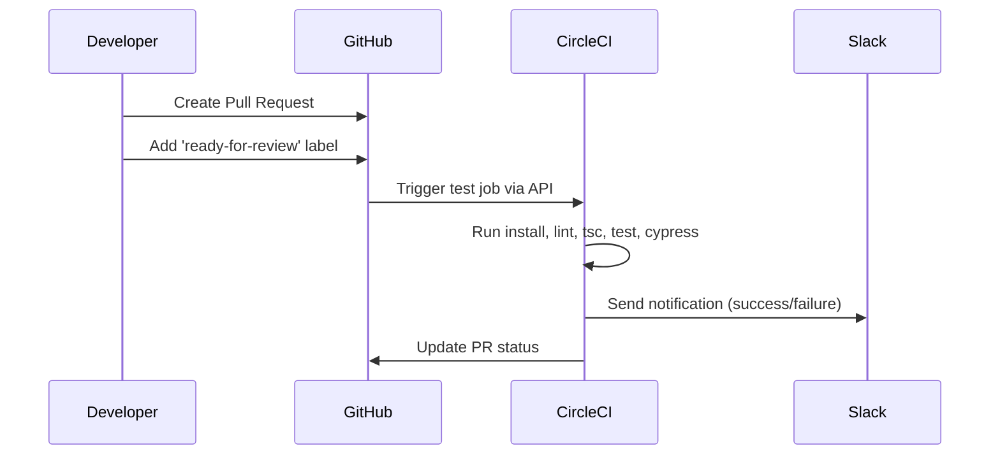
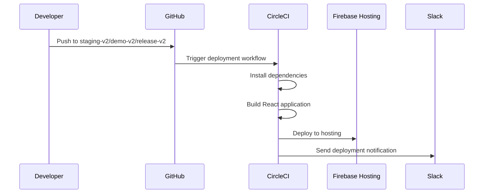
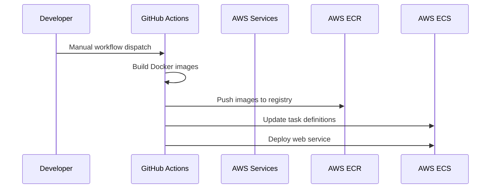
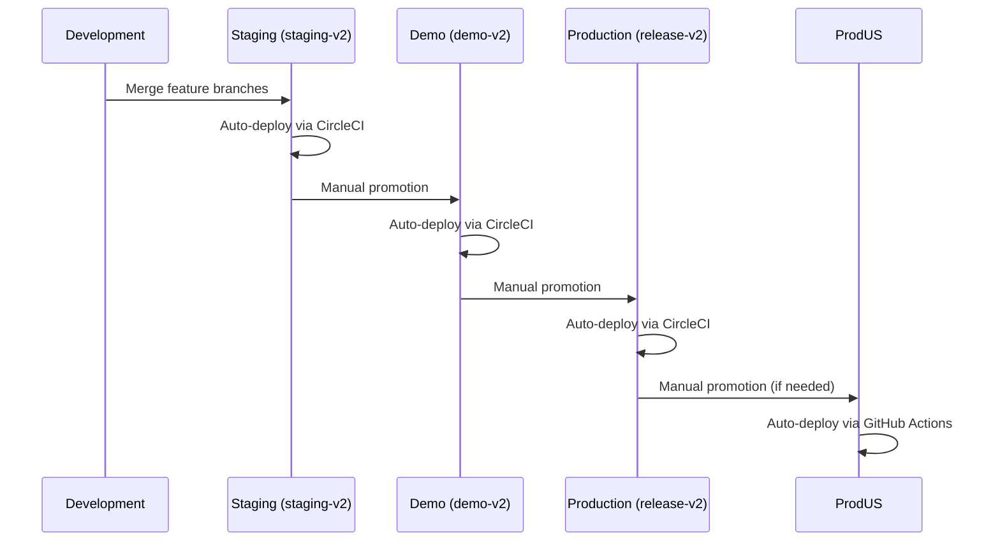
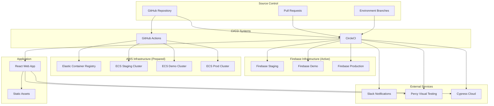
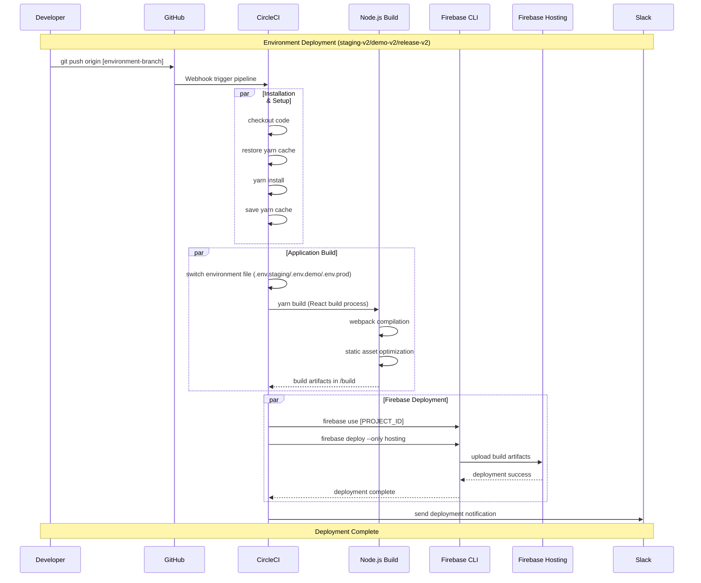
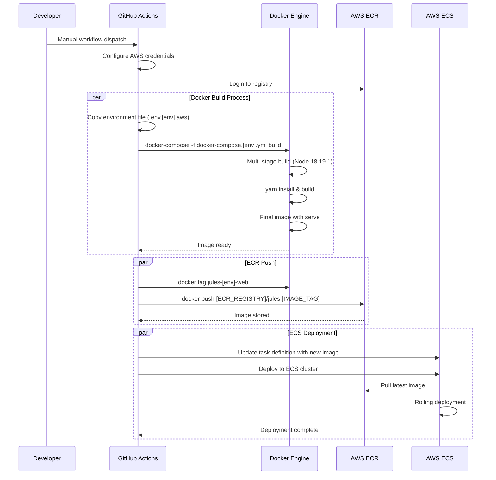
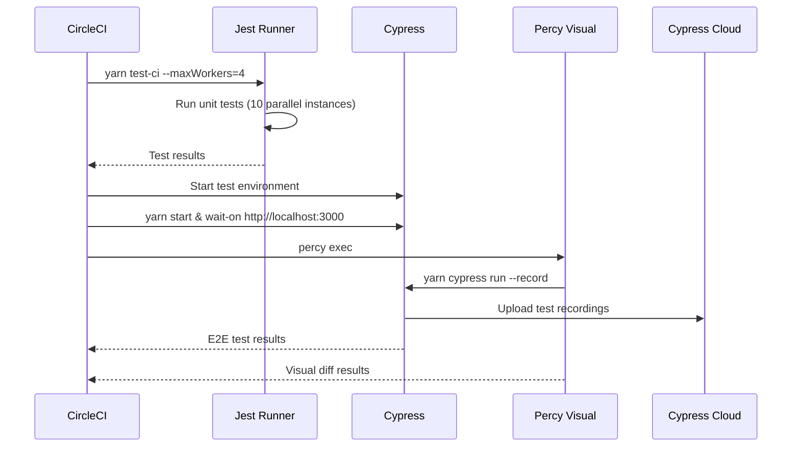

# CI/CD Documentation for Harold Web

## Overview

Harold Web uses a hybrid CI/CD approach with both **CircleCI** and **GitHub Actions** for different deployment strategies:
- **CircleCI**: Primary CI/CD pipeline for Firebase hosting deployments
- **GitHub Actions**: AWS ECS deployments (currently disabled) and workflow management
- **Dual Infrastructure**: Firebase (active) and AWS (prepared but disabled)

## CI/CD Flow Summary

### Pull Request Workflow



### Firebase Deployment Flow (Active)



### AWS Deployment Flow (Disabled but Ready)



### Environment Promotion Flow



## Repository Structure

The repository contains multiple environments and deployment configurations:

### Environments
- **Development**: Feature branches for local development and PR validation
- **Staging** (`staging-v2`): Latest development features for staging testing
- **Demo** (`demo-v2`): Stable features for client demonstrations
- **Production** (`release-v2`): Production-ready code

### Infrastructure Components
- **Web Application**: React TypeScript SPA
- **Firebase Hosting**: Static site hosting
- **AWS ECS**: Container-based hosting (prepared)
- **Docker**: Containerized deployment strategy

### Overall Architecture



## Environments

The application supports four main environments:

| Environment | Branch | CI Platform | Deployment Target | Status |
|-------------|--------|-------------|-------------------|---------|
| **Development** | Feature branches | CircleCI | N/A (PR validation only) | Active |
| **Staging** | `staging-v2` | CircleCI + GitHub Actions | Firebase + AWS ECS | Active |
| **Demo** | `demo-v2` | CircleCI + GitHub Actions | Firebase + AWS ECS | Active |
| **Production** | `release-v2` | CircleCI + GitHub Actions | Firebase + AWS ECS | Active |
| **Production US** | N/A | GitHub Actions | AWS ECS (us region) | Available |

## CircleCI Pipeline (.circleci/config.yml)

### Pipeline Structure

CircleCI handles the primary CI/CD workflow for Firebase deployments and code quality validation.

#### Jobs Configuration

1. **Dependencies & Setup**
   - `install`: Install Node.js dependencies using Yarn for main branches
   - `install-for-pr`: Install dependencies for PR validation
   - Caching strategy: `v6.0.10-yarn-lock-{{ checksum "yarn.lock" }}-{{ arch }}`

2. **Code Quality & Testing**
   - `tsc`: TypeScript compilation check
   - `lint`: ESLint with maximum 0 warnings
   - `lint-new-rules`: Lint only changed files with new rules
   - `lint-goal`: Goal-based linting
   - `test`: Jest unit tests (parallelized across 10 instances)
   - `cypress`: End-to-end testing with Percy visual testing

3. **Application Building**
   - `build-staging`: Build React app for staging environment
   - `build-demo`: Build React app for demo environment
   - `build-prod`: Build React app for production environment

4. **Deployment & Notifications**
   - `deploy-staging`: Deploy to Firebase staging hosting
   - `deploy-demo`: Deploy to Firebase demo hosting
   - `deploy-production`: Deploy to Firebase production hosting
   - `notify-mail-demo`: Send email notifications for demo deployments

#### Detailed CircleCI Deployment Sequence



#### Resource Optimization

**CircleCI Resource Classes:**
- `small`: PR validation jobs
- `medium+`: Linting jobs
- `xlarge`: Build and test jobs (with high memory allocation)

**Performance Optimizations:**
- Node.js memory: `--max_old_space_size=8192`
- OpenSSL legacy provider for build compatibility
- Parallel test execution across 10 instances
- Cypress test parallelization and recording

#### Environment File Management

**Build Process:**
1. Remove existing `.env` file
2. Copy environment-specific file:
   - `mv .env.staging .env` (for staging)
   - `mv .env.demo .env` (for demo)
   - `mv .env.prod .env` (for production)
3. Execute `yarn build` with environment variables

## GitHub Actions Workflows (.github/workflows/)

### Active Workflows

1. **PR Ready for Review** (`pr_ready.yml`)
   - **Trigger**: When PR is labeled with `ready-for-review`
   - **Action**: Triggers CircleCI test job via API
   - **Purpose**: Automated testing on PR readiness

2. **Slack Notifications** (`slack_notification.yml`)
   - **Trigger**: PR merged to `staging-v2` or `demo-v2`
   - **Action**: Send detailed Slack notifications with PR details and commit messages
   - **Purpose**: Team communication and deployment tracking

3. **Remove PR Labels** (`remove-pr-labels.yml`)
   - **Trigger**: New push to any branch
   - **Action**: Removes `ready-for-review` labels from associated PRs
   - **Purpose**: Automated PR label management

### AWS Deployment Workflows (Currently Disabled)

The following workflows are prepared but disabled via `workflow_dispatch` only:

1. **Staging AWS** (`staging-v2.yml`)
   - **Environment**: `staging`
   - **Target**: AWS ECS in `eu-west-3`
   - **Container**: `jules-staging-web`

2. **Demo AWS** (`demo-v2.yml`)
   - **Environment**: `demo`
   - **Target**: AWS ECS in `eu-west-3`
   - **Container**: `jules-demo-web`

3. **Production AWS** (`release-v2.yml`)
   - **Environment**: `prod`
   - **Target**: AWS ECS in `eu-west-3`
   - **Container**: `jules-prod-web`

#### AWS Deployment Process (When Enabled)

**Infrastructure:**
- **ECR Repository**: `jules` in `eu-west-3`
- **ECS Clusters**: Environment-specific (e.g., `jules-staging`, `jules-demo`, `jules-prod`)
- **Task Definitions**: Located in `.aws/` directory

**Detailed AWS Deployment Sequence:**



**Workflow Steps:**
1. **Checkout**: Get the latest code from repository
2. **AWS Authentication**: Configure credentials using secrets
3. **ECR Login**: Authenticate with Elastic Container Registry
4. **Build & Push**: 
   - Copy environment-specific configuration
   - Build Docker image using docker-compose
   - Tag with environment-specific name
   - Push to ECR repository
5. **ECS Deploy**: 
   - Update task definition with new image URI
   - Deploy to ECS cluster with rolling update

## AWS Configuration (.aws/)

### Task Definitions

The `.aws/` directory contains ECS task definitions for each environment:

- `task-definition.staging.json` - Staging web application
- `task-definition.demo.json` - Demo web application
- `task-definition.prod.json` - Production web application

### Resource Allocation

**Standard Web Application Configuration:**
- **CPU**: 256 units
- **Memory**: 512 MB
- **Port**: 80
- **Command**: `["yarn", "serve"]`
- **Platform**: AWS Fargate

**Example Task Definition Structure:**
```json
{
  "containerDefinitions": [
    {
      "name": "jules-staging-web",
      "image": "381492034627.dkr.ecr.eu-west-3.amazonaws.com/jules:jules-staging-web",
      "cpu": 256,
      "memory": 512,
      "portMappings": [
        {
          "containerPort": 80,
          "hostPort": 80,
          "protocol": "tcp"
        }
      ],
      "essential": true,
      "command": ["yarn", "serve"],
      "environment": [
        {
          "name": "ENV",
          "value": "staging"
        },
        {
          "name": "PORT",
          "value": "80"
        }
      ]
    }
  ],
  "family": "jules-staging-web",
  "networkMode": "awsvpc",
  "requiresCompatibilities": ["FARGATE"]
}
```

### Infrastructure Components

- **ECR Repository**: `jules` (stores Docker images in `eu-west-3`)
- **ECS Clusters**:
  - `jules-staging` (staging environment)
  - `jules-demo` (demo environment)  
  - `jules-prod` (production environment)
- **Services**:
  - `jules-staging-web`
  - `jules-demo-web`
  - `jules-prod-web`

## Docker Configuration

### Multi-Stage Dockerfile

The application uses a multi-stage Dockerfile optimized for production:

**Stage 1: Base (Build)**
- **Base Image**: `node:18.19.1-buster`
- **Process**: 
  1. Install dependencies with Yarn
  2. Apply patches using `patch-package`
  3. Copy application code
  4. Build React application (`yarn build`)

**Stage 2: Final (Runtime)**
- **Base Image**: `node:18.19.1-buster-slim`
- **Process**:
  1. Copy built assets from build stage
  2. Install `serve` globally
  3. Expose port 80
  4. Run application with `yarn serve`

### Docker Compose Files

Environment-specific compose files for AWS deployment:
- `docker-compose.staging.yml`: Staging deployment configuration
- `docker-compose.demo.yml`: Demo deployment configuration
- `docker-compose.prod.yml`: Production deployment configuration

**Example Staging Configuration:**
```yaml
version: '3.3'
services:
  api:
    build:
      context: .
      dockerfile: ./Dockerfile
    restart: always
    image: jules-staging-web
    ports:
      - "80:80"
    container_name: jules-staging-web
    env_file:
      - .env.staging.aws
```

## Environment Variables & Secrets

### CircleCI Environment Variables
- `STAGING_PROJECT_ID`: Firebase staging project ID
- `DEMO_PROJECT_ID`: Firebase demo project ID  
- `PRODUCTION_PROJECT_ID`: Firebase production project ID
- `FIREBASE_TOKEN`: Firebase deployment token for CLI authentication
- `DOCKERHUB_PASSWORD`: Docker Hub authentication

### GitHub Actions Secrets (for AWS)
- `AWS_ACCESS_KEY_ID`: AWS access key for ECR and ECS operations
- `AWS_SECRET_ACCESS_KEY`: AWS secret key for authentication
- `CIRCLE_CI_TOKEN`: Token for triggering CircleCI jobs from GitHub
- `GH_NOTIFICATION_TOKEN`: GitHub token for API operations
- `SLACK_WEBHOOK_URL_STAGING`: Slack webhook for staging notifications
- `SLACK_WEBHOOK_URL_DEMO`: Slack webhook for demo notifications

### Application Environment Files

**Firebase Deployment Files:**
- `.env.staging`: Staging environment configuration
- `.env.demo`: Demo environment configuration
- `.env.prod`: Production environment configuration

**AWS Deployment Files:**
- `.env.staging.aws`: AWS-specific staging configuration
- `.env.demo.aws`: AWS-specific demo configuration
- `.env.prod.aws`: AWS-specific production configuration

**Example Environment Variables:**
- `REACT_APP_API_URL`: Backend API endpoint
- `REACT_APP_FIREBASE_CONFIG`: Firebase configuration
- `REACT_APP_ENV`: Environment identifier
- `REACT_APP_SENTRY_DSN`: Error tracking configuration

## Deployment Branches & Strategy

### Branch Strategy

```
feature branches (development)
├── staging-v2 (staging deployments)
├── demo-v2 (demo deployments)
├── release-v2 (production deployments)
```

### Deployment Flow

1. **Development**: Features developed on feature branches with PR validation
2. **Staging**: Merge to `staging-v2` triggers CircleCI staging deployment
3. **Demo**: Merge to `demo-v2` triggers CircleCI demo deployment  
4. **Production**: Merge to `release-v2` triggers CircleCI production deployment

### Feature Branch Workflow

1. Create feature branch from appropriate base branch
2. Development and commits trigger PR validation pipeline
3. Add `ready-for-review` label to trigger comprehensive testing
4. Code review and approval process
5. Merge to target branch triggers deployment pipeline

## Workflow Triggers & Deployment Process

### CircleCI Deployment Triggers

| Branch Pattern | Jobs Triggered | Deployment Target |
|----------------|----------------|-------------------|
| Feature branches | `install-for-pr`, `lint-new-rules`, `lint-goal`, `lint`, `tsc` | None (validation only) |
| `staging-v2` | `install`, `build-staging`, `deploy-staging` | Firebase Staging |
| `demo-v2` | `install`, `build-demo`, `deploy-demo`, `notify-mail-demo` | Firebase Demo |
| `release-v2` | `install`, `build-prod`, `deploy-production` | Firebase Production |

### GitHub Actions Triggers

| Event | Workflow | Action |
|-------|----------|--------|
| Manual dispatch | AWS deployment workflows | Deploy to ECS (currently disabled) |
| PR labeled `ready-for-review` | CircleCI test trigger | Run comprehensive tests |
| PR closed → `staging-v2`, `demo-v2` | Slack notification | Send deployment details |
| Push to any branch | Remove PR labels | Clean up automation labels |

### Firebase Deployment Process (Active)

**Build Phase:**
1. **Dependency Installation**: `yarn install` with caching
2. **Environment Setup**: Switch to appropriate `.env` file
3. **Application Build**: `yarn build` with React optimization
4. **Asset Generation**: Static files optimized for production

**Deploy Phase:**
1. **Firebase Authentication**: Use `FIREBASE_TOKEN` for CLI access
2. **Project Selection**: `firebase use [PROJECT_ID]`
3. **Hosting Deployment**: `firebase deploy --only hosting`
4. **Notification**: Send Slack notifications via webhook

### AWS ECS Deployment Process (Prepared)

**Preparation Phase:**
1. **Code Checkout**: Get latest code from repository
2. **AWS Authentication**: Configure credentials using GitHub secrets
3. **ECR Login**: Authenticate with Elastic Container Registry

**Container Build Phase:**
1. **Environment Setup**: Copy AWS-specific environment file
2. **Docker Build**: Build using environment-specific compose file
3. **Image Tagging**: Tag with environment-specific identifier
4. **Registry Push**: Push to ECR repository

**Service Update Phase:**
1. **Task Definition Update**: Update with new image URI
2. **ECS Deployment**: Deploy updated task definition to cluster
3. **Rolling Update**: ECS handles zero-downtime deployment

## Testing & Quality Assurance

### Code Quality Pipeline

**Linting Strategy:**
- `lint`: Full ESLint validation with 0 warnings policy
- `lint-new-rules`: Validate only changed files against new rules
- `lint-goal`: Goal-oriented linting for gradual improvements

**TypeScript Validation:**
- `tsc`: Full TypeScript compilation check
- Strict mode enforcement
- Type safety validation

### Testing Strategy

**Unit Testing:**
- **Framework**: Jest with React Testing Library
- **Parallelization**: 10 parallel instances for faster execution
- **Coverage**: Comprehensive test coverage requirements
- **Caching**: Jest cache for improved performance

**End-to-End Testing:**
- **Framework**: Cypress with Chrome headless
- **Visual Testing**: Percy integration for visual regression
- **Recording**: Cypress Cloud for test execution recording
- **Environment**: Test environment with mock data

**Test Execution Sequence:**


## Monitoring & Notifications

### Slack Integration

**Deployment Notifications:**
- CircleCI webhook integration via `scripts/notifyWebhook.sh`
- Success/failure status for all deployments
- Build information and deployment URLs

**PR Merge Notifications:**
- Detailed PR information including author, title, and link
- Complete commit history for transparency
- Branch-specific webhook routing to appropriate channels

**Demo Deployment Notifications:**
- Email notifications via `scripts/notifyMailDemo.sh`
- Stakeholder communication for demo environment updates

### Monitoring Stack

**Performance Monitoring:**
- **Percy**: Visual regression testing and monitoring
- **Cypress Cloud**: Test execution and performance tracking
- **Firebase Analytics**: Application usage and performance metrics

**Error Tracking:**
- Application-level error monitoring (configured per environment)
- Build failure notifications via Slack
- Deployment status tracking

**Logging:**
- **AWS CloudWatch**: Container logs from ECS deployments (when enabled)
- **CircleCI**: Comprehensive build and deployment logs
- **GitHub Actions**: Workflow execution logs and artifacts

### Health Checks & Validation

**Application Health:**
- Static asset serving validation
- Environment configuration verification
- API connectivity checks (for integrated services)

**Deployment Validation:**
- Firebase hosting deployment verification
- ECS service health checks (for AWS deployments)
- Post-deployment smoke tests

## Security & Compliance

### Secret Management
- Environment-specific secret injection via CircleCI and GitHub
- Secure handling of Firebase tokens and AWS credentials
- Separation of concerns between Firebase and AWS configurations

### Code Quality Standards
- ESLint with strict rules and 0 warnings policy
- TypeScript strict mode enforcement
- Automated code quality checks in CI pipeline
- Visual regression testing to prevent UI regressions

## Performance Optimization

### Build Optimization

**Node.js Configuration:**
- Memory allocation: `--max_old_space_size=8192`
- OpenSSL legacy provider: `--openssl-legacy-provider`
- Parallel processing for faster builds

**Caching Strategy:**
- **Yarn Dependencies**: `v6.0.10-yarn-lock-{{ checksum "yarn.lock" }}-{{ arch }}`
- **ESLint Cache**: `v3-eslint-{{ .Revision }}-{{ arch }}`
- **Jest Cache**: `v3-jest-{{ .Revision }}-{{ arch }}`
- **Cypress Cache**: Stored in `~/.cache/Cypress`

### Resource Tuning

**CircleCI Resource Classes:**
- **Small**: Basic validation jobs
- **Medium+**: Linting and code quality jobs
- **XLarge**: Build and test jobs requiring high memory

**Test Optimization:**
- Jest parallelization across 10 instances
- Cypress test recording and parallelization
- Test result caching for faster subsequent runs

## Status and Maintenance

### Current Status

- **CircleCI**: Fully operational for Firebase deployments
- **GitHub Actions AWS**: Currently disabled (manual dispatch only)
- **All environments**: Functional with Firebase hosting
- **Dual deployment strategy**: Firebase (active) + AWS (prepared)

### Known Issues

1. **AWS deployments are currently disabled** for automatic triggers
2. Some workflows use deprecated GitHub Actions versions
3. Docker Hub authentication relies on personal credentials
4. Manual intervention required for AWS deployment activation

### Recommended Improvements

1. **Security**: 
   - Migrate to organization-managed Docker Hub account
   - Implement AWS IAM roles instead of access keys
   - Add security scanning to Docker builds
   - Implement secret rotation policies

2. **Reliability**:
   - Add health checks to ECS deployments
   - Implement blue-green deployment strategy
   - Add deployment rollback capabilities
   - Set up automated failover between Firebase and AWS

3. **Efficiency**:
   - Optimize Docker image sizes with multi-stage builds
   - Implement build caching for faster deployments
   - Add deployment status checks and automated rollbacks
   - Optimize bundle sizes and loading performance

4. **Monitoring**:
   - Add comprehensive application performance monitoring
   - Implement deployment success/failure tracking
   - Add automated smoke tests post-deployment
   - Set up alerting for deployment failures

## Troubleshooting

### Common Issues

1. **CircleCI Build Failures**
   - **Memory Issues**: Check `NODE_OPTIONS` memory allocation
   - **Environment Files**: Verify `.env.*` file availability and format
   - **Cache Issues**: Clear dependency cache if builds fail inconsistently
   - **Test Failures**: Check parallelization settings and test isolation

2. **Firebase Deployment Issues**
   - **Token Expiration**: Verify `FIREBASE_TOKEN` validity
   - **Project Configuration**: Check project ID configuration
   - **Build Artifacts**: Ensure `build/` directory contains valid assets
   - **Hosting Rules**: Verify `firebase.json` configuration

3. **AWS Deployment Issues**
   - **Credentials**: Verify AWS access key permissions for ECR and ECS
   - **ECR Access**: Check repository accessibility and region settings
   - **Task Definition**: Validate JSON syntax and resource allocation
   - **ECS Capacity**: Ensure cluster has sufficient resources

4. **PR Automation Issues**
   - **Label Triggers**: Verify `ready-for-review` label application
   - **CircleCI API**: Check `CIRCLE_CI_TOKEN` validity
   - **Slack Webhooks**: Verify webhook URLs and permissions

### Debug Commands

```bash
# Local development debugging
yarn start                           # Start development server
yarn build                          # Test production build
yarn test                           # Run unit tests
yarn lint                           # Check code quality

# Firebase debugging  
firebase login                      # Authenticate locally
firebase projects:list --token $FIREBASE_TOKEN
firebase use --add                  # Add project alias
firebase serve                      # Test hosting locally

# AWS debugging
aws sts get-caller-identity         # Verify AWS credentials
aws ecr get-login-password --region eu-west-3
docker build -t test-image .        # Test Docker build locally
docker-compose -f docker-compose.staging.yml build

# CircleCI debugging
# Check build logs in CircleCI dashboard
# Verify environment variables in project settings
# Test SSH access to CircleCI containers (if enabled)
```

### Health Checks

**Application Health:**
- **Development**: `http://localhost:3000` accessibility
- **Firebase**: Hosting URL accessibility and correct content
- **AWS ECS**: Service running status and health check endpoints

**Build Health:**
- **Dependencies**: `yarn install` success rate
- **Tests**: Unit and E2E test pass rates
- **Linting**: Code quality metrics and warning trends
- **Performance**: Build time trends and optimization opportunities

## Rollback Strategy

### Firebase Rollback
- **Manual Process**: Use Firebase console to rollback to previous release
- **CLI Rollback**: Deploy previous build artifacts
- **Database**: No database rollback needed (static hosting)

### AWS Rollback (when enabled)
- **ECS Service**: Rollback via AWS console to previous task definition
- **ECR Images**: Deploy previous image tags
- **Automated**: Implement deployment rollback automation

### Emergency Procedures
1. **Identify Issue**: Monitor application and user reports
2. **Assess Impact**: Determine scope and severity
3. **Execute Rollback**: Use appropriate rollback strategy
4. **Verify Recovery**: Confirm application functionality
5. **Post-Incident**: Document and analyze root cause

---

*Last updated: August 4, 2025*
*Repository: harold-waste/harold-web*
*Branch: staging-v2*
